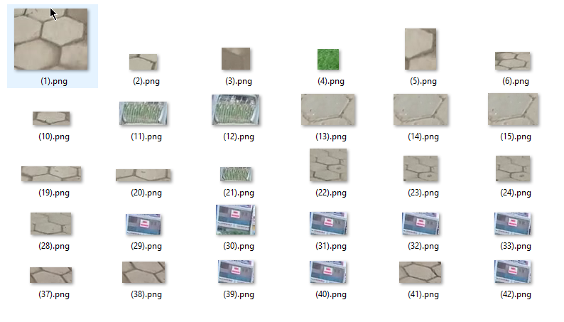

# Traffic signs detection and classification in real time

### A new version using SSD will be released this summer for anyone need higher accuracy detection method. Stay tuned for new update!

### 1. Description ###
This project is a traffic signs detection and classification system on videos using OpenCV.
The detection phase uses Image Processing techniques that create contours on each video frame and find all ellipses or circles among those contours. They are marked as candidates for traffic signs.

Detection strategy:
1. Increase the contrast and dynamic range of the video frame
2. Remove unnecessary colors like green with HSV Color range
3. Use Laplacian of Gaussian to display border of objects
4. Make contours by Binarization.
5. Detect ellipse-like and circle-like contours

In the next phase - classification phase, a list of images are created by cropping from the original frame based on candidates' coordinate. A pre-trained SVM model will classify these images to find out which type of traffic sign they are.

Currently supported traffic signs (*The name of each sign's file is corresponding to their class in SVM*):
 
Note:
- *All signs which belong to class 8 and above are marked as **OTHERS** because a competition requires this. There is also a class 0 which are marked as non-traffic-sign*
- *Only the **biggest** sign in the current frame is cropped and classified*

The SVM Model is trained each time the ```main.py``` called, before the detection phase but I still save the model in [data_svm.dat](data_svm.dat) to implement the model-reload function in the future to avoid retraining phase.

If a traffic sign is detected, it will be tracked until it disappears or there is another bigger sign in the frame. The tracking method is [Dense Optical Flow](https://docs.opencv.org/trunk/d7/d8b/tutorial_py_lucas_kanade.html).
### 2. Prerequisites:
- Python 3.5
- [OpenCV3](https://opencv.org/)
- Imutils (use```pip3 install imutils``` to install)

### 3. System structure
##### a. There are 3 python files as 3 modules:
- [main.py](main.py) :The start point of the program.
- [classification.py](classification.py) :SVM Model to classify traffic signs
- [common.py](common.py) :Functions for defining SVM Model

Other files:
- [data_svm.dat](data_svm.dat) : Saved SVM model after training.
- [README.md](README.md) : This file, obiviously :)

##### b. [Dataset](dataset)
The [Dataset](dataset) folder contains images for training SVM models. There are 12 folders contains cropped images of traffic signs. Each folder is named as the class of the traffic signs it contains. The special [0](dataset/0) folder contains non-traffic-sign cropped images which can be recognized as traffic signs in the detection phase. 


The dataset is created by applying the detection phase on many videos with various parameters to mark all traffic signs and then manually separating them into their right classes.

Each time run the program, the dataset can be updated by checking all generated cropped images of detected traffic signs, then find all misclassified traffic signs.
### 4. Installation
#### There are two ways of running the program:
Use default arguments:
```sh
$python3 main.py
```
Use custom arguments: 
```sh
$python3 main.py
optional arguments:
  -h, --help            show this help message and exit
  --file_name FILE_NAME
                        Video to be analyzed
  --min_size_components MIN_SIZE_COMPONENTS
                        Min size component to be reserved
  --similitary_contour_with_circle SIMILITARY_CONTOUR_WITH_CIRCLE
                        Similarly to a circle
```
### 5. Result

### 6. Disadvantages
- Static image processing, this means parameters must be updated for each video with different lighting conditions
- The accuracy of the detection phase is not high, still, miss signs or detect wrong areas.
- The dataset is a little bit overfitting for classification phase. 
### 7. Future developments
- Better performance with higher framerate
- Use other approaches like YOLO or SSD
- Dynamic image processing
- Use CNN to classification
- No need to retrain the model when running the program
- Make a bigger dataset
### 8. License

[MIT License](LICENSE)
© 2018 Hoàng Lê Hải Thanh (Thanh Hoang Le Hai) aka GhostBB

